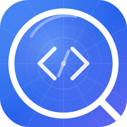

  

<h1 align="center">Tapspect</h1>

  iOS debug shell for inspecting web apps on the go

  

---

  
   
  <em>Replace this with an actual screenshot — ideally showing the debug panel open over a web app, with a few console logs and network requests visible.</em>

---

A minimal iOS app that wraps your web app in a `WKWebView` with a built-in **floating debug panel** for viewing console output and network requests — no Safari Web Inspector needed.

The ideal companion for [Happy](https://happy.engineering/) & [ngrok](https://ngrok.com/): review Claude/Codex-generated websites on your phone, tap the floating bug button to see console logs and network activity, then copy errors into Happy for instant debugging help.

## Features

- **Full WKWebView** — loads any URL, supports back/forward gestures
- **Draggable FAB** — floating debug button that snaps to screen edges
- **Console tab** — captures `console.log/info/warn/error/debug`, uncaught errors, and unhandled promise rejections
- **Network tab** — intercepts `fetch()` and `XMLHttpRequest` calls with method, status, timing, request and response values
- **Screenshot tab** — Upload screenshots to a server and get a shareable URL in clipboard (requires implementing the upload endpoint yourself)
- **Resizable panel** — drag the handle to resize the debug sheet
- **Error badge** — shows error count on the FAB when the panel is closed

## Quick Start

1. **Open** `Tapspect.xcodeproj` in Xcode
2. **Select your device** (or simulator) and hit **Run** (⌘R)
3. Tap the **bug button** to open the debug panel

## How It Works

JavaScript is injected at document start that:

- **Overrides** `console.log/info/warn/error/debug` to forward messages to Swift via `WKScriptMessageHandler`
- **Wraps** `window.fetch()` and `XMLHttpRequest.prototype.open/send` to capture request method, URL, status code, and duration
- **Listens** for `error` and `unhandledrejection` window events

All data flows through `WebViewModel` (an `ObservableObject`) to the SwiftUI debug panel.

## Screenshot Uploads with ImgBB

The screenshot tab can upload to any server, but [ImgBB](https://imgbb.com/) is an easy free option:

1. Create a free account at [imgbb.com](https://imgbb.com/) and grab your API key from [api.imgbb.com](https://api.imgbb.com/)
2. In Tapspect, open the debug panel and go to the **Screenshots** tab
3. Tap the gear icon and configure:

| Setting | Value |
|---------|-------|
| **Upload URL** | `https://api.imgbb.com/1/upload?key=YOUR_API_KEY` |
| **Field Name** | `image` |
| **Response URL Key Path** | `data.url` |

Leave the API Key and Basic Auth fields empty — the key is passed in the URL.

Once enabled, every time you take a screenshot the image is uploaded and the public URL is copied to your clipboard automatically.

## Requirements

- Xcode 15+
- iOS 26.0+
- Swift 5.9+

## Notes

- `webView.isInspectable = true` is set, so Safari Web Inspector also works in debug builds
- The network interceptor captures **JavaScript-initiated** requests. Navigation-level requests (page loads, iframes) are logged via `WKNavigationDelegate`
- For localhost testing, use your Mac's local IP (e.g., `http://192.168.1.x:3000`) since the simulator/device can't reach `localhost` on your Mac directly (simulator can, physical device cannot)

## License

MIT
